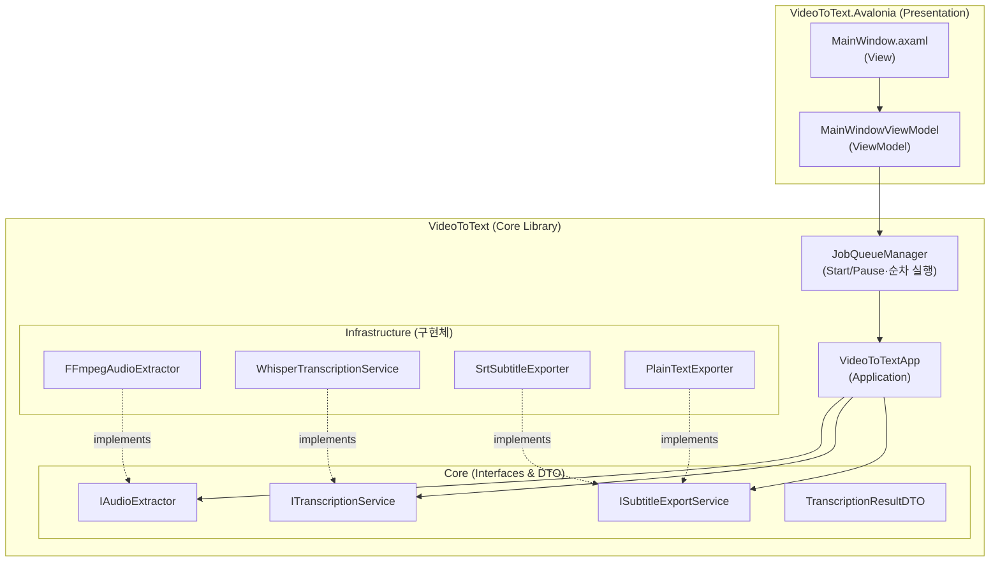
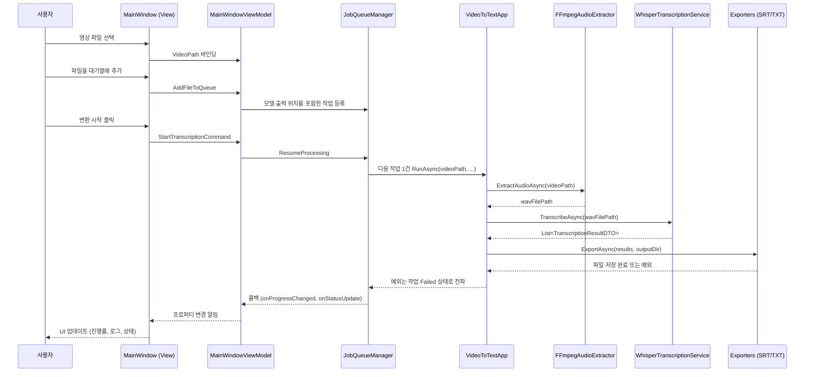
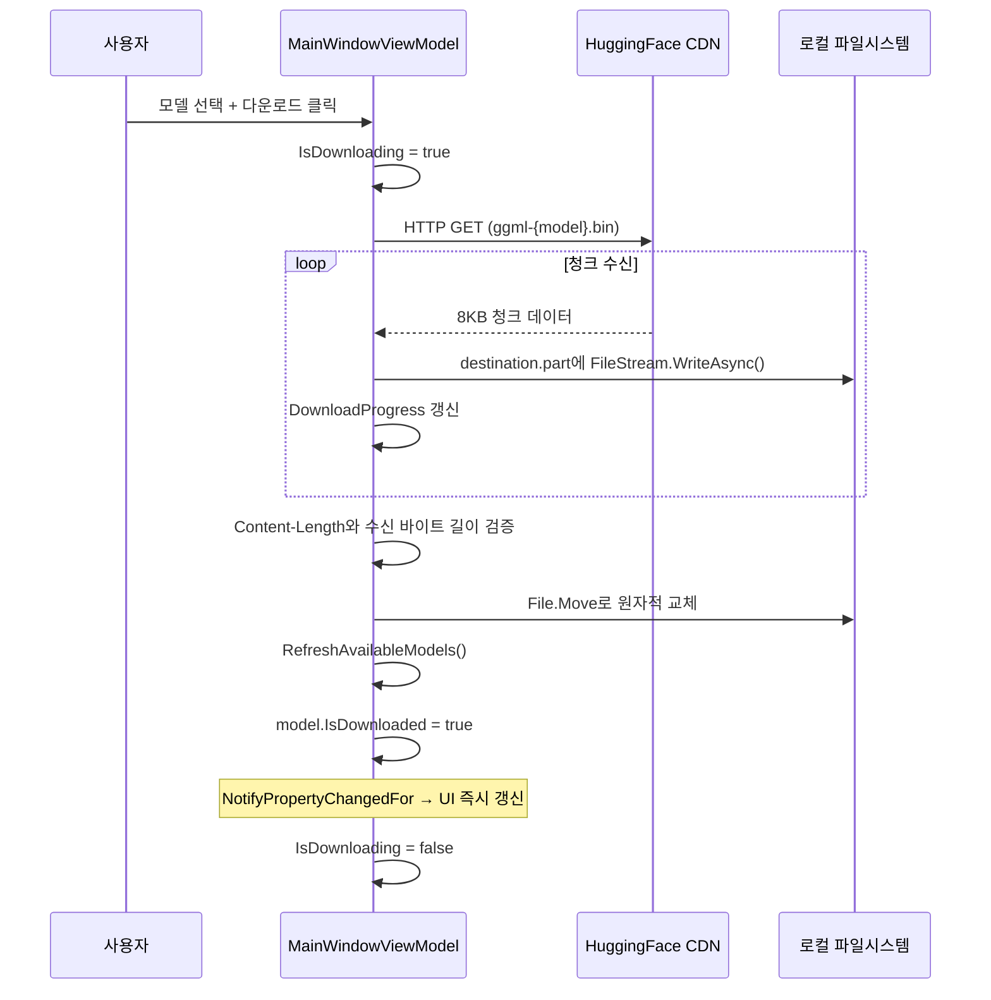

# 비디오 텍스터 (Video Texter) — 아키텍처 문서

> **문서 버전**: 1.0  
> **작성일**: 2026-04-05

---

## 1. 계층 구조 (Layer Architecture)



---

## 2. 데이터 흐름 (Data Flow)



---

## 3. 모델 다운로드 흐름



모델 해석은 `LocalApplicationData/VideoTexter/Models`를 먼저 확인하고, 없을 때만 legacy 앱 번들의 `Models`를 읽습니다. 새 다운로드는 primary 경로에만 기록합니다.

`VideoToTextApp`은 작업마다 OS 임시 폴더 아래 UUID 디렉터리와 고유 WAV 이름을 만들고 `finally`에서 정리합니다. SRT/TXT exporter는 `FileMode.CreateNew`로 기존 결과를 덮어쓰지 않으며, 내보내기 예외는 앱과 대기열까지 전파되어 해당 작업이 Failed로 표시됩니다.

---

## 4. FFmpeg 탐색 우선순위

앱 실행 시 FFmpeg 바이너리를 탐색하는 우선순위:

```
1. [앱 번들 내부] Contents/MacOS/ffmpeg       ← 최우선 (Standalone)
2. [시스템 설치] /opt/homebrew/bin/ffmpeg      ← 폴백 (개발 환경)
```

---

## 5. 클래스 역할 요약

| 클래스 | 역할 | 의존성 |
|--------|------|--------|
| `MainWindowViewModel` | UI 상태 관리, 큐 등록·Start/Pause 커맨드 처리 | `JobQueueManager` |
| `JobQueueManager` | 등록 스냅샷의 모델/출력으로 한 작업씩 실행, 실패 상태 표시 | `VideoToTextApp` |
| `VideoToTextApp` | 전체 파이프라인 조율 | `IAudioExtractor`, `ITranscriptionService`, `ISubtitleExportService` |
| `FFmpegAudioExtractor` | 영상 → WAV 오디오 추출 | `Xabe.FFmpeg` |
| `WhisperTranscriptionService` | WAV → 텍스트 변환 (STT) | `Whisper.net` |
| `SrtSubtitleExporter` | 결과 → `.srt` 자막 파일 | 순수 C# |
| `PlainTextExporter` | 결과 → `.txt` 텍스트 파일 | 순수 C# |
| `ModelInfo` | 모델 데이터 + UI 바인딩 | `CommunityToolkit.Mvvm` |
| `TranscriptionResultDTO` | 인식 결과 전송 객체 | 없음 (POCO) |

---

## 6. 음성 입력 경로

`FFmpegMicrophoneRecorder`는 FFmpeg `avfoundation` 장치 목록에서 기본 또는 선택 마이크를 고르고 AAC 128k M4A를 사용자 선택 출력 폴더에 기록한다. 정상 종료 후 비어 있지 않은 임시 파일만 고유한 `녹음_yyyyMMdd_HHmmss.m4a`로 확정해 기존 대기열 등록 경로에 전달한다. 이 등록은 변환을 자동 시작하지 않는다.

macOS 패키지의 `Info.plist`에는 `NSMicrophoneUsageDescription`을 포함한다. 실시간 변환, 파형 표시, 편집, 노이즈 제거 파이프라인은 없다.
