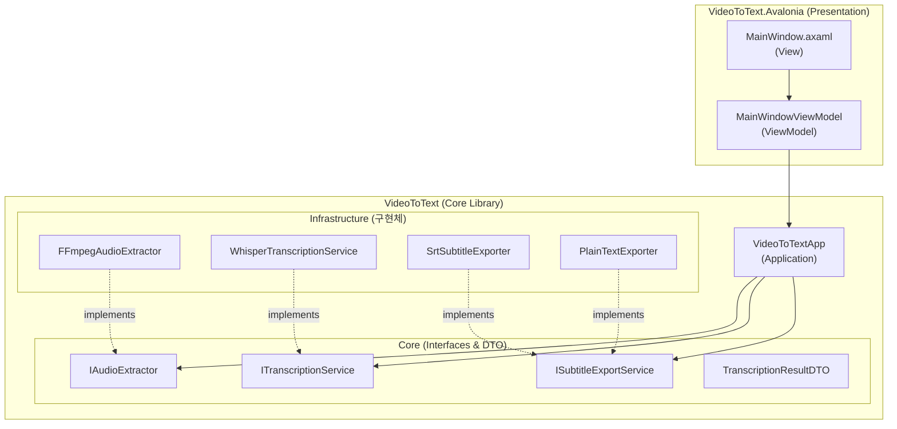
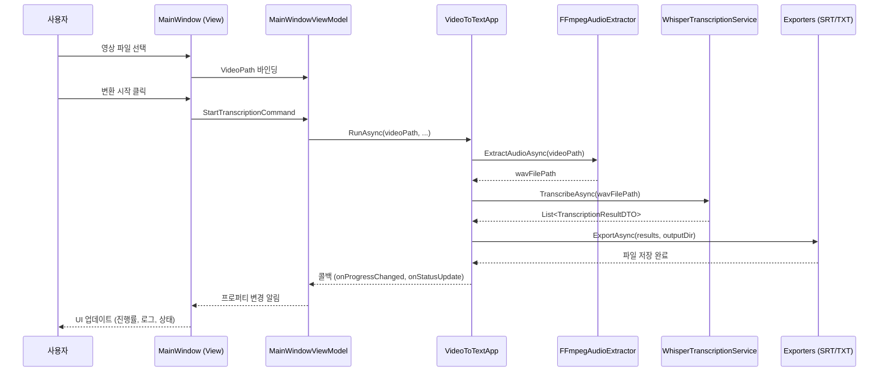
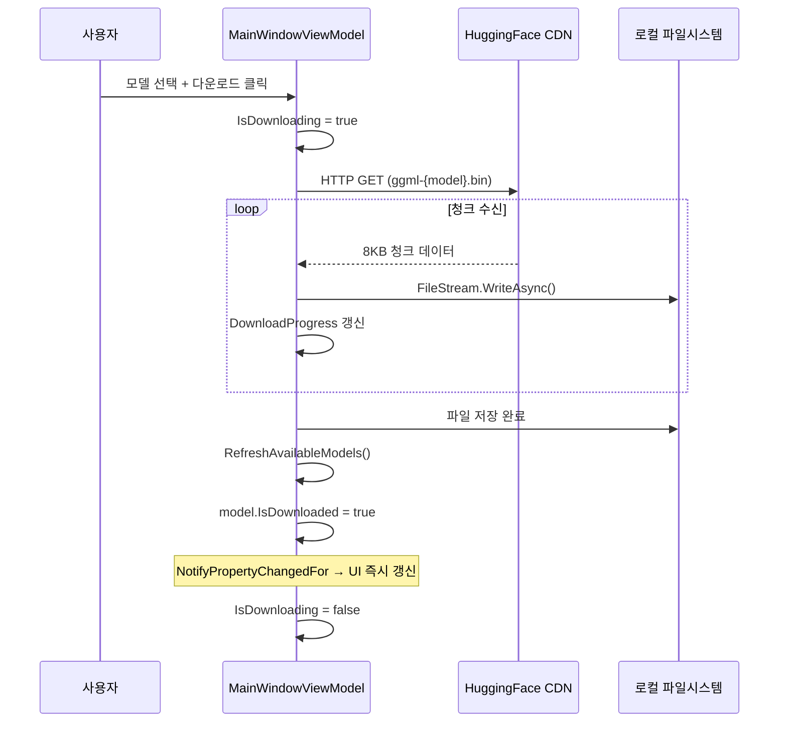

# 비디오 텍스터 (Video Texter) — 아키텍처 문서

> **문서 버전**: 1.0  
> **작성일**: 2026-04-05

---

## 1. 계층 구조 (Layer Architecture)



---

## 2. 데이터 흐름 (Data Flow)



---

## 3. 모델 다운로드 흐름



---

## 4. FFmpeg 탐색 우선순위

앱 실행 시 FFmpeg 바이너리를 탐색하는 우선순위:

```
1. [앱 번들 내부] Contents/MacOS/ffmpeg       ← 최우선 (Standalone)
2. [시스템 설치] /opt/homebrew/bin/ffmpeg      ← 폴백 (개발 환경)
```

---

## 5. 클래스 역할 요약

| 클래스 | 역할 | 의존성 |
|--------|------|--------|
| `MainWindowViewModel` | UI 상태 관리, 커맨드 처리 | `VideoToTextApp` |
| `VideoToTextApp` | 전체 파이프라인 조율 | `IAudioExtractor`, `ITranscriptionService`, `ISubtitleExportService` |
| `FFmpegAudioExtractor` | 영상 → WAV 오디오 추출 | `Xabe.FFmpeg` |
| `WhisperTranscriptionService` | WAV → 텍스트 변환 (STT) | `Whisper.net` |
| `SrtSubtitleExporter` | 결과 → `.srt` 자막 파일 | 순수 C# |
| `PlainTextExporter` | 결과 → `.txt` 텍스트 파일 | 순수 C# |
| `ModelInfo` | 모델 데이터 + UI 바인딩 | `CommunityToolkit.Mvvm` |
| `TranscriptionResultDTO` | 인식 결과 전송 객체 | 없음 (POCO) |
